  

# Multi-Functional Print（MFP） Management System of Neo Image Service Corporation（NISC）
## Concept

MFP System used for management that includes print logger、deposit logger、department、user、card、cardreader、watermark and output the report.

## Syllabus

Basically, we developed by Visual Studio 2022, and choice Linq to Entity for the CRUD MySQL database, it returns the type of interface IQueryable object, in progress, founded it's hard to debug、monitor, and checkout of the variable that is currently.

After that, to get rid of this restriction, we found the OzCode for code analysis and more than additional functionals for code debugging, in the previous version, OzCode was free to use the functional part in Visual Studio 2019, but now in Visual Studio 2022, it joins the DataDog Company and no longer for free using, for that, we installed Visual Studio 2019 for this reason.

In addition, there is another reason why needed to install Visual Studio 2019, its MySQL Database was already created, and with the help of ORM techniques, Visual Studio only supports SQL Server, to successfully support MySQL, we need to download driver [**MySQL for Visual Studio**][1], it only supports to Visual Studio 2019 currently, so this is why need another IDE for development, but the MySQL ORM was already created, you could not concern this issue, the only reason for concern perhaps needs OzCode debugging LINQ queries, except you have any better useful solution for that, that will not be the reason of installation Visual Studio 2019.

## Development Environment

### Tools

- Visual Studio 2022
- Visual Studio 2019（Optional）
- Git（Version Control）
- Sourcetree（Visualization for Git, optional）

### Build With

- C#
- HTML
- CSS
- JavaScript（jQuery）
- AJAX

### Library & Framework

  
C#

  
   - ASP.NET MVC
   - Entity Framework v6.4.4 
   - AutoMapper v10.1.1（latest for current EF） 
   - EntityFramework.DynamicLinq v1.3.2 
   - MySal.Data v8.0.32.1 
   - MySql.Data.EntityFramework v8.0.32 

  
CSS

  
  - Bootstrap v5.2
  - Animate.css v4.1.1（Optional）

  
JavaScript

  
  - jQuery v3.4.1
  - jQuery DataTables v1.13.4
  - jQuery DataRangePicker v3.0.5
  - SweetAlert2 v11.7.3
  - Font Awesome v6.4.0

### Software Architecture

- MVC
- Layer Architecture（3 tiers）
- Presentation Layer
- Business Layer（named for \*Service）
- Data Access Layer（named for \*Repository）

## Diagram

  
Software Architecture

  
   

[1]: https://downloads.mysql.com/archives/visualstudio/
